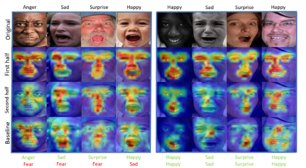
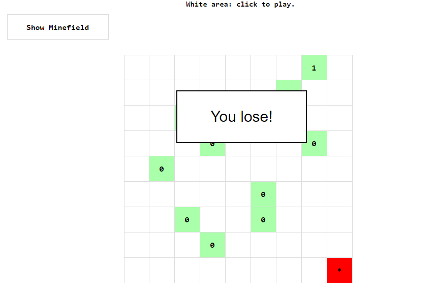
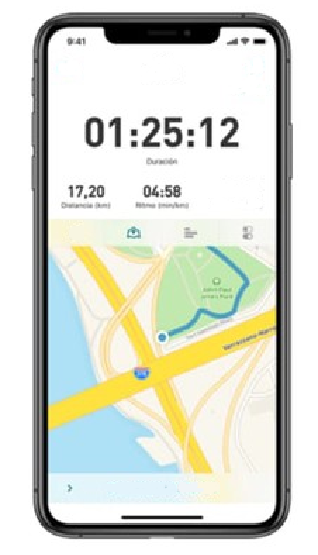

# Hi There !
I'm Martin Jarnier, a French Engineer in computer science.

My main field is the data sciences and more precisely machine learning but I have other interests in coding.

Take a look at my projects😊!

## Machine Learning
### Deep Learning algorithms in Breakout

<table>
    <tr>
    <td> 
        
    
<b> Before Training </b>

    </td>
    <td> 
        
    
<b> During Training </b>

    </td>
    <td> 
        
    
<b> After Training </b>

    </td>
    </tr>
</table>

An implementation of the well Known Paper  [Playing Atari with Deep Reinforcement Learning](https://arxiv.org/abs/1312.5602) with the DQN method.

### Some computer vision

Another paper implementation of the latest method of feature and emotion identification on images named [PAC(Privileged Attribution Constrained)](https://arxiv.org/abs/2203.12905). We used here two differents models to first extract facial feature and then process informations 

### A touch of NLP

I develop a bot that can summarize and extract keypoint of meetings from any audio source. It use Speach to text module and a collection of various model which perform NLP analysis dont hesitate to check out.
 

We use Docker to make it easier of use

## Mobile Apps
A collections of Android App i develop to learn  Java and Javascript but i still use them even today !

A simple minesweeper mobile application. Produced with java,html and css.

A running app that can keep track of your performances. Produced with the Flutter framework in Dart.

<!-- ## Some stats
 -->

<!--  -->

## Contact
<a href="https://www.linkedin.com/in/martin-jarnier/"> LinkedIn</a>

 [Professional](mailto:martin.jarnier@gmail.com "martin.jarnier@gmail.com")
 
